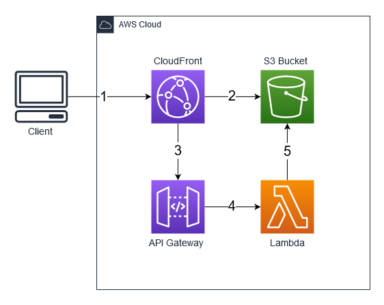

# Amazon CloudFront with on-the-fly Image Resizing

**WARNING: THIS SOLUTION IS AN EXAMPLE ONLY AND NO SUPPORT IS PROVIDED!**

## How it works

The purpose of this solution is to serve images through Amazon CloudFront with support for on-the-fly image resizing. The solution uses CloudFront, S3, API Gateway, and Lambda. The CloudFront distribution includes a cache behavior with an origin group and two origins. The following explains the flow of image requests made through the CloudFront URL.



1. When a request is made for an image through the CloudFront distribution, if the image exists in the CloudFront cache, CloudFront will return the cached image and no further processing is needed.
1. If the image does not exist in the CloudFront cache, CloudFront will send a request to the primary origin.  The primary origin is an S3 bucket. The S3 bucket will return requests for the original image and common image sizes that are available as objects in the bucket.
1. If the requested image does not exist, and a 403 or 404 HTTP response status code is received from S3, CloudFront will failover to the secondary origin.  The secondary origin is a regional API Gateway HTTP API.
1. The HTTP API will route the event to a Lambda function.
1. The function will retrieve the original image from S3, resize it using [Sharp](https://www.npmjs.com/package/sharp), and return the resized image. Subsequent requests for the same image and dimensions will be returned from the CloudFront cache.

Important: this application uses various AWS services and there are costs associated with these services after the Free Tier usage - please see the [AWS Pricing page](https://aws.amazon.com/pricing/) for details. You are responsible for any AWS costs incurred. No warranty is implied in this example.

## Requirements

* [Create an AWS account](https://portal.aws.amazon.com/gp/aws/developer/registration/index.html) if you do not already have one and log in. The IAM user that you use must have sufficient permissions to make necessary AWS service calls and manage AWS resources.
* [AWS CLI](https://docs.aws.amazon.com/cli/latest/userguide/install-cliv2.html) installed and configured
* [Git Installed](https://git-scm.com/book/en/v2/Getting-Started-Installing-Git)
* [AWS Serverless Application Model](https://docs.aws.amazon.com/serverless-application-model/latest/developerguide/serverless-sam-cli-install.html) (AWS SAM) installed

## Deployment Instructions

1. Create a new directory, navigate to that directory in a terminal and clone the GitHub repository:
    ``` 
    git clone https://github.com/gadavis2/samples
    ```
1. Change directory to the cloudfront-resize-image directory:
    ```
    cd cloudfront-resize-image
    ```
1. From the command line, use [AWS SAM](https://aws.amazon.com/serverless/sam/) to build and deploy the AWS resources as specified in the template.yml file:
    ```
    sam build
    sam deploy --guided
    ```
1. During the prompts:
    * Stack Name: cloudfront-resize-image
    * AWS Region: {enter your preferred region}
    * Parameter AppName: cloudfront-resize-image
    * Confirm changes before deploy: Y
    * Allow SAM CLI IAM role creation: Y
    * Disable rollback: N
    * Save arguments to configuration file: Y
    * SAM configuration file: {press enter to use default name}
    * SAM configuration environment: {press enter to use default name}

    Once you have run `sam deploy --guided` mode once and saved arguments to a configuration file (samconfig.toml), you can use `sam deploy` in future to use these defaults.

1. Note the outputs from the SAM deployment process. These contain the resource names and/or URLs which are used for testing.

1. Copy the example images to the S3 bucket: 

    Syntax: 
    ```
    aws s3 sync images\ s3://{S3BucketName}/
    ```

    Example:
    ```
    aws s3 sync images\ s3://cloudfront-resize-image-s3bucket-1hhdpdwdlkbgv/
    ```

## Testing

1. Wait for the CloudFront distribution to fully propogate which may take several minutes (sometimes up to one hour) or you will receive an **Access Denied** error.
1. From a web browser, view images by using the CloudFrontSecureUrl:
    * The first request for the original image and common image sizes will be returned from the S3 bucket origin. Subsequent requests for the same image will be returned from the CloudFront cache.

        Syntax:
        ```
        {CloudFrontSecureUrl}/original/example.jpg
        {CloudFrontSecureUrl}/100x100/example.jpg
        {CloudFrontSecureUrl}/500x500/example.jpg
        ```
        
        Example original or common image sizes:
        ```
        https://d39kt9ysj1q5rn.cloudfront.net/original/example.jpg
        https://d39kt9ysj1q5rn.cloudfront.net/100x100/example.jpg
        https://d39kt9ysj1q5rn.cloudfront.net/500x500/example.jpg
        ```

    * The first request for an uncommon image size will be returned from the HTTP API origin after Lambda retrieves the original image from the S3 bucket and resizes it based on the requested dimensions. Subsequent requests for the same image and dimensions will be returned from the CloudFront cache.

        * Example uncommon image size: `{CloudFrontSecureUrl}/250x375/example.jpg`
        * Example uncommon image size: `{CloudFrontSecureUrl}/725x1100/example.jpg`

    * Incorrectly formatted requests or requests for images that do not exist in the S3 bucket will return a transparent 1x1 pixel.

        * Example incorrect request format: `{CloudFrontSecureUrl}/250-375/example.jpg`
        * Example image that does not exist: `{CloudFrontSecureUrl}/nope.jpg`

## Cleanup

1. First delete/empty the objects in the S3 bucket.
1. Then delete the CloudFormation stack.